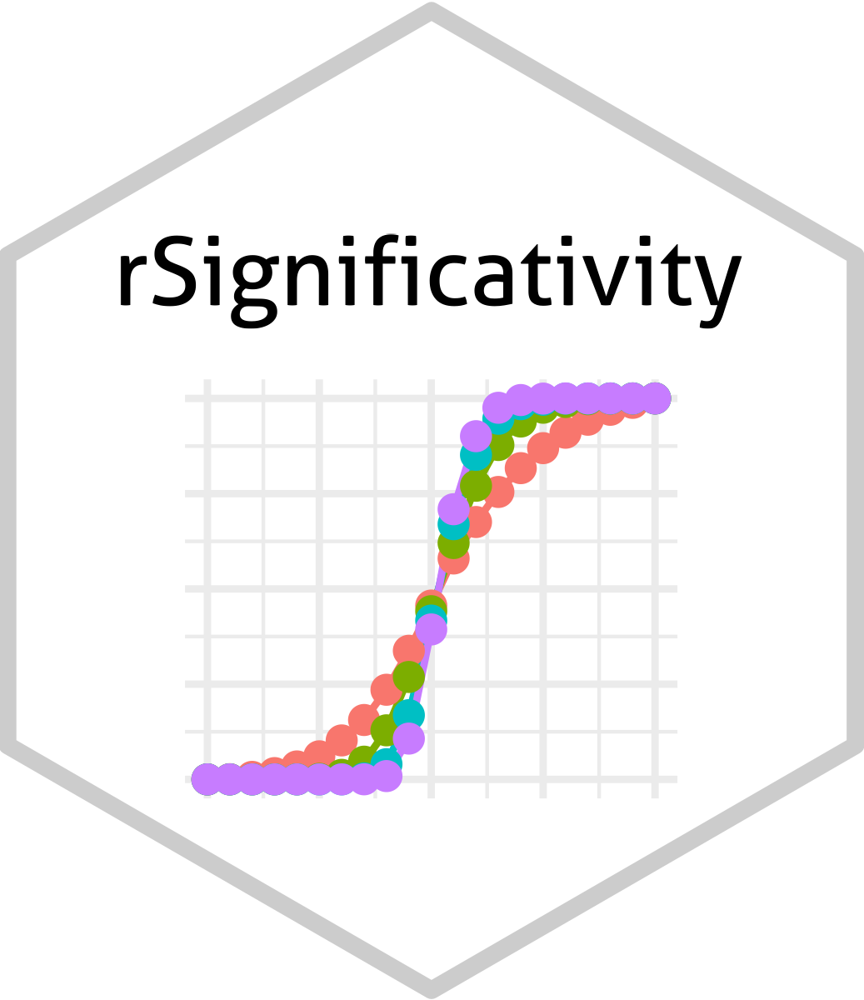

  
  ```{r, include = FALSE}
knitr::opts_chunk$set(
  collapse = TRUE,
  comment = "#>",
  fig.path = "man/figures/README-",
  out.width = "100%"
)
```

# rSignificativity <a href="albertocasagrande.github.io/rSignificativity"></a>

<!-- badges: start -->
<!--
[](https://github.com/albertocasagrande/rSignificativity/actions)
[](https://github.com/albertocasagrande/rSignificativity/actions/workflows/pkgdown.yaml)
-->
<!-- badges: end -->

`rSignificativity` is an R package that implements the $\sigma$-significativity for statistical coefficients.

#### Help and support

## [](https://albertocasagrande.github.io/rSignificativity/)

### Installation

In order to install the development version of `rSignificativity`, you need:

* [R and Rtools](https://cran.r-project.org)

* the R package [`devtools`](https://devtools.r-lib.org)

* [git](https://git-scm.com/downloads)

When the requirements have been satisfied, issue the R command:

``` r
devtools::install_github("albertocasagrande/rSignificativity")
```


------------------------------------------------------------------------

#### Copyright and contacts

Copyright (c) 2025 Alberto Casagrande <alberto.casagrande@uniud.it>
